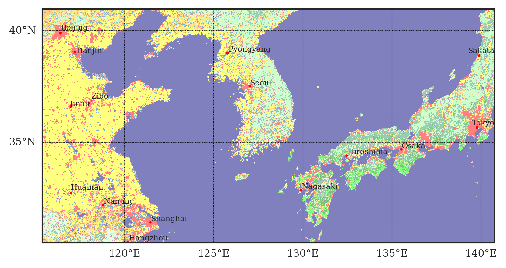

# MCD_Plotter

## Overview

**MCD_Plotter** is a Python-based tool designed to visualize the MCD12Q1 (MODIS Land Cover Type) dataset in an intuitive way using Cartopy and Matplotlib. The script processes MCD data files and overlays city information to produce land cover maps, allowing users to easily identify different land cover classes and cities on a map.

This project is intended for users who want to explore and visualize land cover data based on the IGBP classification. A demonstration notebook is also provided to showcase how the script can be used with sample data.

While it's possible to use Google Earth's API to access MCD land cover data for visualization, this can sometimes be unreliable for large-scale operations, especially when generating a large number of images or when network access to Google services is unstable. In such cases, this repository provides an alternative solution. You can download the MCD land cover data in advance and use the provided scripts to generate maps without relying on external services. This allows for flexible and efficient visualization, particularly when dealing with large datasets.



## Features

- **Visualize MCD Land Cover Data**: The script reads HDF or HDF5 land cover data from MCD12Q1 files and plots the data in various projections.
- **Customizable City Locations**: Users can display specific cities on the map by using the city locator functionality.
- **Projection Support**: Cartopy projections like Sinusoidal, Plate Carree, Mercator, and Lambert Conformal are supported.
- **Adjustable Color Maps**: The script utilizes the IGBP classification and corresponding color schemes to highlight different land cover classes.
- **Lat/Lon Gridlines**: Easily add latitude and longitude gridlines to maps.

## Getting Started

### Prerequisites

Ensure you have the following Python packages installed:

- `numpy`
- `matplotlib`
- `cartopy`
- `geopandas`
- `h5py`
- `pyhdf`
- `scipy`
- `adjustText`
- `glob`

You can install the required packages via `pip`:

```bash
pip install numpy matplotlib cartopy geopandas h5py pyhdf scipy adjustText
```

### Installation
1. Clone the repository:

```bash
git clone https://github.com/your-username/MCD_Plotter.git
cd MCD_Plotter
```

2. A minimal sample MCD12Q1 dataset is provided in the sample_data/ folder for demo purposes. If you want to explore larger datasets, you can download the full MCD12Q1 files from the [USGS LP DAAC Website](https://lpdaac.usgs.gov/products/mcd12c1v061/).

### Demo
The main script is `land_cover.py`, which contains the `LandCoverPlotter` class. A demo is provided in the form of a Jupyter Notebook (`demo.ipynb`), which shows how to use `LandCoverPlotter` to create maps with city labels and different projections.


## Data Source
* Land Cover data (MCD12Q1) can be obtained from:
[NASA LP DAAC MCD12Q1](https://lpdaac.usgs.gov/products/mcd12c1v061/)
* City data is from the Natural Earth database:
[Natural Earth Vector Data](https://github.com/nvkelso/natural-earth-vector)

## Sample Data
This repository contains sample data (`MCD12Q1.A2022001.*`) and shape files (`ne_10m_populated_places`). Existing shape files is good to go. For full MCD datasets, users should download them from the official sources above.

## License
This project is licensed under the MIT License - see the LICENSE file for details.